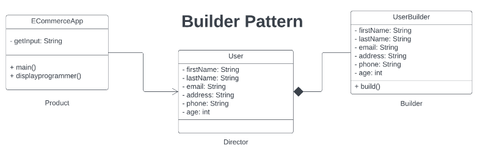

# Builder Pattern
The Builder Pattern is a design pattern used in object-oriented programming that allows for the creation of complex objects step-by-step by separating the construction of an object from its representation. The main idea behind this pattern is to provide a flexible and easy-to-use interface to build different types of objects without having to expose their internal details or complexities.


## Problem Scenario

**Imagine you're developing an e-commerce application where customers create accounts with varying levels of detail.**
____________________________________________________________________


Initially, you use a standard constructor for the User class:

```
public User(String firstName, String lastName, String email,
           String address, String phone, int age) {
     // ...
}
```

However, you encounter challenges:
<ul>
<li>Registration forms: It's cumbersome to ensure users enter all fields in the correct order, leading to errors and frustration.</li>
<li>Optional fields: Not all customers provide complete information, but the constructor forces them to.</li>
<li>Data consistency: Changes to user profiles after registration can cause unexpected issues due to mutable fields.</li>
</ul>

Implement solution using the Builder Pattern to address the issue.

## Implementation of Builder Pattern

<p align="center">
    
</p>

##  Unified Modeling Language (UML) Class Diagram

<p align="center">
    
</p>