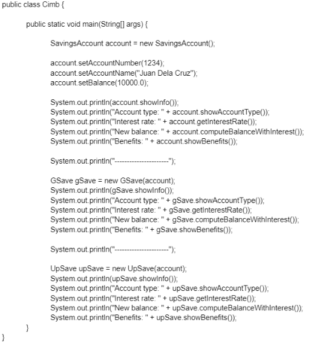
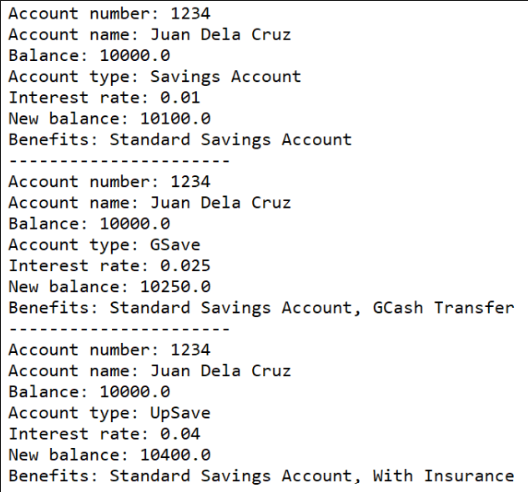
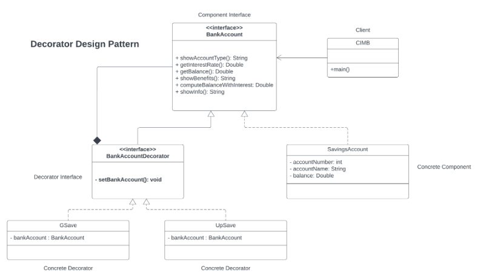

# Decorator Pattern
A structural design pattern used in software engineering that allows behavior to be added to individual objects, dynamically, without affecting the behavior of other objects from the same class. It is used to extend the functionalities of objects in a flexible and reusable way.

## Problem

Cimb is a digital bank that offers GSave and UpSave savings accounts. As with a typical Savings Account, it contains accountNumber, accountName, and a balance for that account.

<li> The typical savings account offers an interest rate of 1%. The benefits of the typical savings account is the same with the "Standard Savings Account" as compared to other banks.

<li> The GSave account offers an interest rate of 2.5%. Benefits include the "Standard Savings Account" plus access to "GCash transfer".

<li> The UpSave account offers the highest interest rate of 4.0%. Benefits include the "Standard Savings Account" plus "with Insurance".

The content of your Cimb.java should ONLY contain the following codes with the exception of inserting your own package name : 
----------------------------------------------------------------------------------------------------------------------------------
  

  

  You should display the following output:     
  

**Description of the following methods**
---------------------------------------------------------------------------------------------------------------------------------- 
1. **showAccountType()** - Either returns "Savings Account", "GSave" or "UpSave"
2. **getInterestRate()** - Either returns 1% for Savings Account; 2.5% for GSave; 4.0% UpSave
3. **getBalance()** - Returns the balance of the account set.
4. **showBenefits()** - Either returns "Standard Savings Account" for Savings Account;
benefits offered by savings account + "GSave Transfer";
benefits offered by savings account + "With Insurance";
5. **computeBalanceWithInterest()** - returns new balance by computing the balance plus the interest depending on the interest rate.
6. **showInfo()** - Returns details of account number, account name, and balance.

**BankAcountDecorator** must be an interface.
---------------------------------------------------------------------------------------------------------------------------------- 
Follow instructions. You are not allowed to insert other methods except what is stated in the diagram (setters and getters are allowed).

## Implementation of Decorator Pattern

    

## Unified Modeling Language (UML) Class Diagram

    

