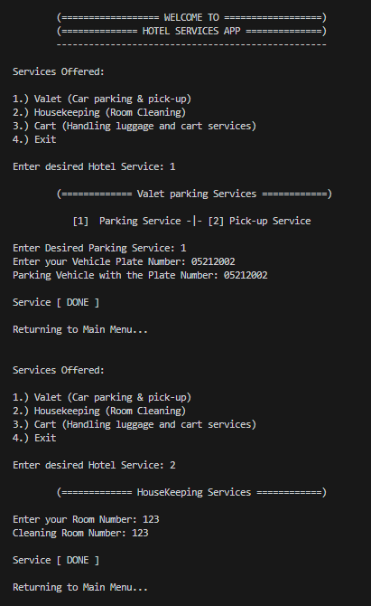
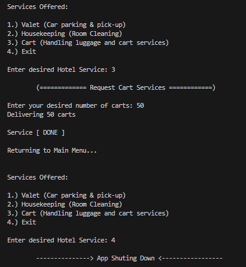
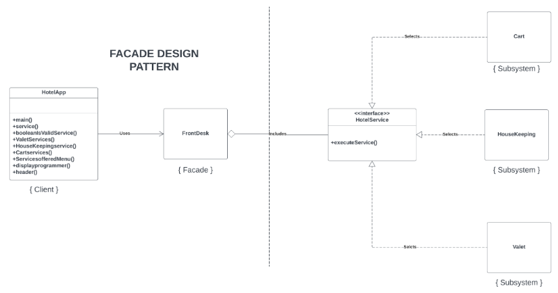

# Facade Pattern
The Facade Design Pattern is a structural design pattern that provides a unified interface to a set of interfaces in a subsystem. It defines a higher-level interface that makes the subsystem easier to use. In simple words, the Facade Design Pattern is used to hide the complexities of a system and provides an easy-to-use interface to the client using which the client can access the system.

## Simplified Hotel Management System

The HotelApp needs to manage various hotel services for guest check-in and check-out. These services include valet parking for vehicles, room cleaning, and handling luggage carts. However, the HotelApp aims to interact with these services through a simplified, single interface provided by the FrontDesk. The FrontDesk class should delegate the client's requests to the appropriate service classes (Valet, HouseKeeping, Cart) while abstracting the service details from the client.

## Class Definitions
- HotelService (Interface): Defines the common interface for all hotel services.  
- Valet: A service class implementing the HotelService interface, responsible for vehicle valet parking and pick-up. It includes the pickUpVehicle(plateNumber) method.  
- HouseKeeping: A service class implementing the HotelService interface, responsible for room cleaning. It includes the cleanRoom(roomNumber) method.  
- Cart: A service class implementing the HotelService interface, responsible for handling luggage cart requests. It includes the requestCart(numberOfCarts) method.  
- FrontDesk: The facade class that coordinates interactions between the client (HotelApp) and the individual hotel services.  
- HotelApp: The client class that uses the FrontDesk facade to access and utilize hotel services seamlessly.  

## Implementation of Facade Pattern

     
     

## Unified Modeling Language (UML) Class Diagram

     

