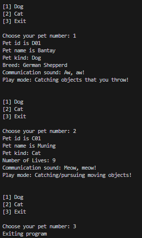

# Factory Pattern 

A creational design pattern used in software engineering that provides an interface for creating objects in a superclass but allows subclasses to alter the type of objects that will be created. This pattern promotes loose coupling by eliminating the need to bind application-specific classes into the code. The creation of an object is delegated to a factory class, which abstracts the instantiation process.

## Problem 
Implement factory design pattern using Pet as the factory interface.  The interface implements two methods: makeSound() and play().

- Dog and Cat are concrete objects that implements Pet interface.  
- PetRecord holds attributes such as petId, petName, and Pet.   
- Clinic would be the client object.   
- Refer to the UML Class Diagram   

## Implementation of Factory Pattern

    

## Unified Modeling Language (UML) Class Diagram

