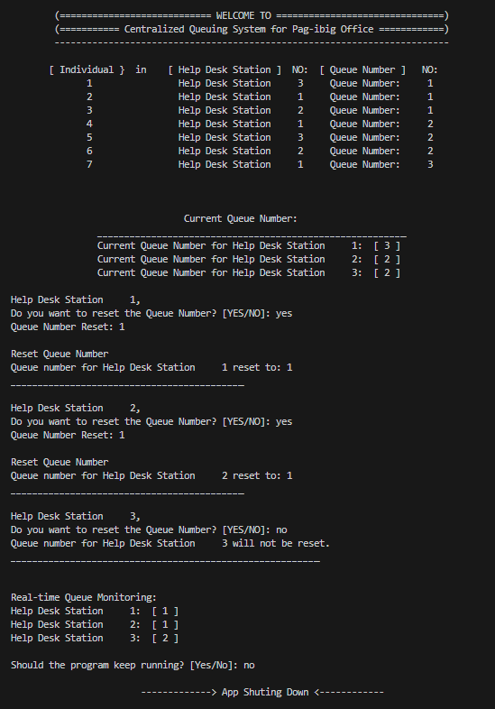

# Singleton Pattern

A design pattern that ensures a class has only one instance and provides a global point of access to that instance. This pattern is useful when you want to restrict the instantiation of a class to a single object, which can be beneficial for scenarios where only one instance of a class is needed to control access to a shared resource or to maintain a single state across the entire application.

**Centralized Queuing System for Pag-ibig Office**
____________________________________________________________________

The Pag-ibig office implements a centralized queuing system for three help desk stations. Individuals visiting the office obtain a queue number from this centralized system. Additionally, there's an online monitoring system that displays the current queued number in real-time for individuals monitoring the queue remotely.

Each help desk station has an option to reset the queuing number based on an inputted number, allowing flexibility in managing the queue during specific situations, such as reorganization or technical issues. This queuing system ensures a single centralized queue number for all help desk stations, while the reset option offers control and adjustment in exceptional circumstances.

This approach aims to maintain an organized queuing process for individuals visiting the office and provides the flexibility to handle queue adjustments as needed.

## Implementation of Singleton Pattern

     

## Unified Modeling Language (UML) Class Diagram

  

