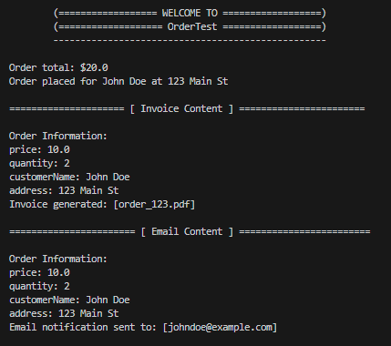
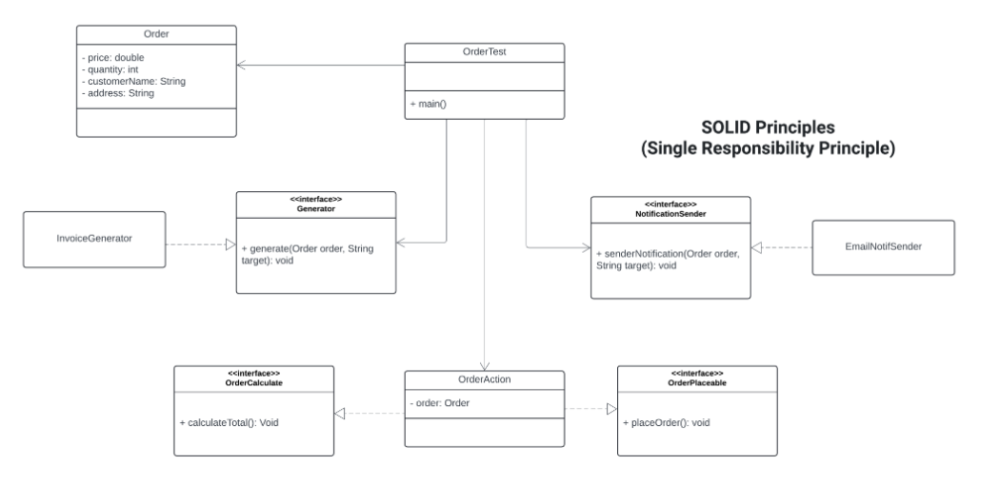

# SOLID Principles in Object-oriented Programming

The SOLID principles are a set of five design principles that help developers create more maintainable, flexible, and scalable object-oriented software. Each principle focuses on a specific aspect of software design, promoting code readability, reusability, and maintainability.

1. Single Responsibility Principle (SRP): This principle states that a class should have only one reason to change, meaning it should have only one responsibility or job. By adhering to SRP, classes become more focused and easier to understand, test, and maintain.
2. Open/Closed Principle (OCP): The Open/Closed Principle suggests that software entities (classes, modules, functions, etc.) should be open for extension but closed for modification. This means that you should be able to extend the behavior of a module without modifying its source code.
3. Liskov Substitution Principle (LSP): LSP states that objects of a superclass should be replaceable with objects of its subclasses without affecting the correctness of the program. In other words, derived classes must be substitutable for their base classes without altering the desirable properties of the program.
4. Interface Segregation Principle (ISP): ISP emphasizes that clients should not be forced to depend on interfaces they do not use. Instead of one large interface, it's better to have multiple smaller interfaces, each serving a specific purpose.
5. Dependency Inversion Principle (DIP): DIP suggests that high-level modules should not depend on low-level modules, but both should depend on abstractions. It promotes decoupling between modules by introducing abstractions/interfaces, allowing for easier modification and testing.

## Common Pitfalls Failing to Implement SOLID Principles

There are several common problems that can arise if you don't apply SOLID principles in object-oriented programming (OOP):

<ul>
<li>Tight Coupling
<li>Brittle Code
<li>Hard to Test Code
<li>Inflexible Design
<li>Large Class Hierarchy </li>
</ul>

## Problem scenario:
____________________________________________________________________

Improve the following codes to implement SOLID principles in OOP.

```
public interface Order {

  void calculateTotal(double price, int quantity);
  void placeOrder(String customerName, String address);
  void generateInvoice(String fileName);
  void sendEmailNotification(String email);
}

```

```
public class OrderAction implements Order {

  @Override
  public void calculateTotal(double price, int quantity) {
    double total = price * quantity;
    System.out.println("Order total: $" + total);
  }

  @Override
  public void placeOrder(String customerName, String address) {
    // Simulate placing order in a system
    System.out.println("Order placed for " + customerName + " at " + address);
  }

  @Override
  public void generateInvoice(String fileName) {
    // Simulate generating invoice file
    System.out.println("Invoice generated: " + fileName);
  }

  @Override
  public void sendEmailNotification(String email) {
    // Simulate sending email notification
    System.out.println("Email notification sent to: " + email);
  }
}

```

```
public class OrderTest {

  public static void main(String[] args) {
    Order order = new OrderAction();
    order.calculateTotal(10.0, 2);
    order.placeOrder("John Doe", "123 Main St");

    // These methods might not be needed for all orders
    order.generateInvoice("order_123.pdf");
    order.sendEmailNotification("johndoe@example.com");
  }
}

```

## Implementation of Solid Principles

<p align="center">
    <br>
</p>


## Unified Modeling Language (UML) Class Diagram

<p align="center">
    <br>
</p>