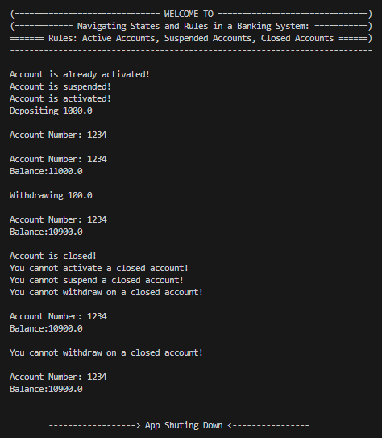

# State Design Pattern in Java

The state design pattern is a behavioral pattern that allows an object to change its behavior when its internal state changes. Instead of having multiple conditional statements within the object's code, each state becomes a separate object responsible for handling its specific behavior. This makes the code more maintainable, extensible, and easier to understand.

## Application of State Design Pattern in BankAccount

A bank needs to manage different states of customer accounts, including active, suspended, and closed. Each state has specific rules and restrictions regarding allowed operations, and accounts have associated attributes like account number and balance.

<li> Active accounts: Allow deposits and withdrawals. <br>
<li> Suspended accounts: Disallow deposits and withdrawals transactions, but allow viewing account information.  <br>
<li> Closed accounts: Disallow all transactions and viewing of account information. <br>

Currently, the system relies on conditional statements within the Account class to check the account state and determine valid actions. This approach becomes cumbersome and error-prone as the number of states and their associated logic grows.

Implement the State pattern to improve code maintainability and flexibility:
```
1. Define Account States: Create separate classes representing different account states: ActiveState, SuspendedState, and ClosedState.
2. Implement State Interface: Define an interface AccountState with methods for common actions like deposit, withdraw, activate, suspend, and close.
3. Implement State Behaviors: Each concrete state class implements the AccountState interface, providing specific behavior for its respective state.
                              For example, the ActiveState class would allow deposits and withdrawals,
                              while the ClosedState wouldn't allow any transactions.
4. Update Account Class:
         - Include attributes for accountNumber and balance.
         - Remove state-specific logic from the Account class.
         - Introduce a reference to the current AccountState object.
         - Delegate actions like deposit, withdraw, activate, suspend, and close to the
           current state object through its corresponding methods.

```
## Logic:

```
If the account is active
    You can either suspend it or close it.
If the account is suspended
    You can either activate or close it.
     No deposits and withdrawals allowed.
If the account is closed
     You can neither suspend nor activate it.
      No deposits and withdrawals allowed.
```
```
Composition of Account:
attributes:
accountNumber : String
balance:  Double
accountState:  AccountState

Methods:
Setter and getter methods
deposit(Double depositAmount): void
withdraw(Double withdrawAmount): void
suspend(): void
activate(): void
close() : void
toString() // displays account number and balance

Note:  No if-else, switch will be used
--------------------------------------------------
```

```
Create AccountTest() class to test the Account:
public class AccountTest(){
	public static void main (String[] args){

		Account myAccount = new Account("1234", 10000.0); // set acct to active state
		myAccount.activate(); // displays "Account is already activated!"

		// Suspend the account
		myAccount.suspend(); //displays "Account is suspended!"

		// Activate the account
		myAccount.activate() //displays "Account is activated!"
		
		// Deposit to the account
		myAccount.deposit(1000.0);// update balance and displays account number and
		// current balance. Call the toString() method in deposit().    	                                

		// Withdraw to the account
		myAccount.withdraw(100.0);// update balance and displays account number and
		// current balance. Call the toString() method in withdraw().    	                                

		//Close the account()
		myAccount.close() //displays "Account is closed!"

		//Activate the account
		myAccount.activate() // Displays "You cannot activate a closed account!"	

		//Suspend the account
		my.Account.activate() // Displays " You cannot suspend a closed account!"


		//Withdraw to the account
		myAccount.withdraw(500.0);// Show message "You cannot withdraw on a closed
                              // account!". Call the toString() to show current
                              // balance and account number.

		//Deposit to the account
		myAccount.deposit(1000.0);// Show message "You cannot deposit on closed account!".
                              // Call the toString() to show current balance and account number.
            }
    }

```

## Implementation of Strategy Pattern

<p align="center">
    
</p>

## Unified Modeling Language (UML) Class Diagram

<p align="center">
  
</p>
