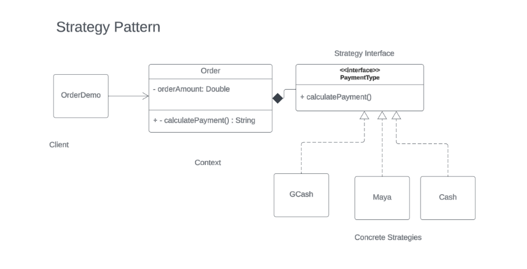

# Strategy Pattern

The Strategy Pattern is a **behavioral design pattern** that enables defining a family of algorithms, encapsulating each one, and making them interchangeable. It allows the algorithm to vary independently from clients that use it. This pattern promotes the "favor composition over inheritance" principle by creating interchangeable objects that can be swapped at runtime. In Java, the Strategy Pattern is implemented using interfaces to define various strategies and allowing concrete classes to implement these interfaces to provide specific behaviors.


##  Why Use the Strategy Pattern
There are several reasons for using the Strategy Pattern in software development:

1. **Flexibility:** The Strategy Pattern allows for easy swapping of algorithms at runtime, making the code more flexible and adaptable to changing requirements.
2. **Encapsulation:** Each algorithm is encapsulated within its own class, promoting better code organization and maintainability.
3. **Reusability:** Strategies can be reused in multiple contexts, reducing code duplication and promoting code reuse.
4. **Testability:** By isolating algorithms into separate classes, unit testing becomes easier, as each strategy can be tested independently.
5. **Decoupling:** The Strategy Pattern helps in decoupling the client code from the implementation details of the algorithms, leading to loosely coupled systems that are easier to maintain and extend.


##  How Strategy Pattern Solves the "God Object" Problem
The "God object" anti-pattern refers to a class that knows or does too much, violating the **Single Responsibility Principle (SRP)**and leading to tightly coupled and difficult-to-maintain code. By using the Strategy Pattern, different algorithms are encapsulated within separate strategy classes, eliminating the need for a single class to handle multiple responsibilities. Each strategy class focuses on a single algorithm, adhering to the SRP and promoting better code organization. This approach prevents the proliferation of a monolithic class that tries to do everything, effectively solving the "God object" problem and improving the overall design of the system.


##  Components of the Strategy Pattern
The Strategy Pattern typically consists of the following components:

1. **Strategy Interface:** An interface that defines the contract for all concrete strategy classes. It declares a method or set of methods that encapsulate the algorithm to be used.
2. **Concrete Strategies:** Concrete classes that implement the strategy interface, providing specific implementations of the algorithm.
3. **Context:** A class that maintains a reference to a strategy object and delegates the algorithm's execution to it. The context class allows clients to dynamically change the strategy at runtime.
4. **Client:** The client code that interacts with the context object. Clients can change the strategy used by the context object without modifying its code, promoting flexibility and reusability.


##  Unified Modeling Language (UML) Class Diagram

<p align="center">
    
</p>


## Problem Codes:
```
public class Order{
    private Double orderAmount;
    private String paymentType;
    
    public Order (Double orderAmount, String paymentType){
        this.orderAmount = orderAmount;
        this.paymentType = paymentType;
    }

    public String calculatePayment(){
        String output = new String();

        if(paymentType.equals("GCash")){
            output += "Gcash is your payment type!\n" +
                      "You earned 10 energy points!";
                     
        } else if (paymentType.equals("Maya")){
            output += "Maya is your payment type!\n" +
                      "You have 1% additional interest in Savings!";
        } else{
            output += "You paid in cash!\n" +
                      "No incentives!";
        }

        return "Your payment amount is " + orderAmount + "\n" + output;

    }
}

public interface PaymentType{
    public String calculatePayment();
}

public class GCash implements PaymentType{
    public String calculatePayment(){
        String output = new String();
        output += "Gcash is your payment type!\n" +
                      "You earned 10 energy points!";
        return output;

    }
}

public class Maya implements PaymentType{
    public String calculatePayment(){
        String output = new String();
        output += "Maya is your payment type!\n" +
                  "You have 1% additional interest in Savings!";
        return output;
    }
}

public class Cash implements PaymentType{
    public String calculatePayment(){
        String output = new String();
        output += "You paid in cash!\n" +
                      "No incentives!";
        return output;
    }
}
```
## Refactored
```
public class OrderDemo{
    public static void main(String[] args){
        Order order = new Order (1200.00, new Cash());
        System.out.println(order.calculatePayment());    
    }
}

public class Order{
    private Double orderAmount;
    private PaymentType paymentType;

    public Order(Double orderAmount, PaymentType paymentType){
        this.orderAmount = orderAmount;
        this.paymentType = paymentType;
    }

    public String calculatePayment(){
        return "Your payment amount is " + orderAmount + "\n" + 
               paymentType.calculatePayment();
    }    
}
```


