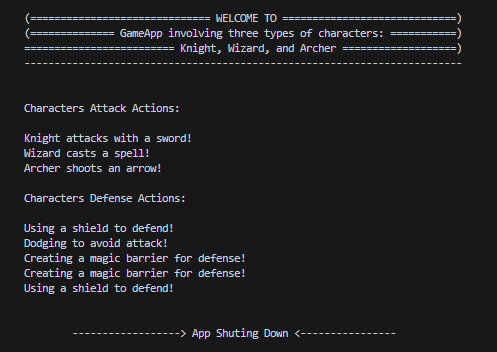
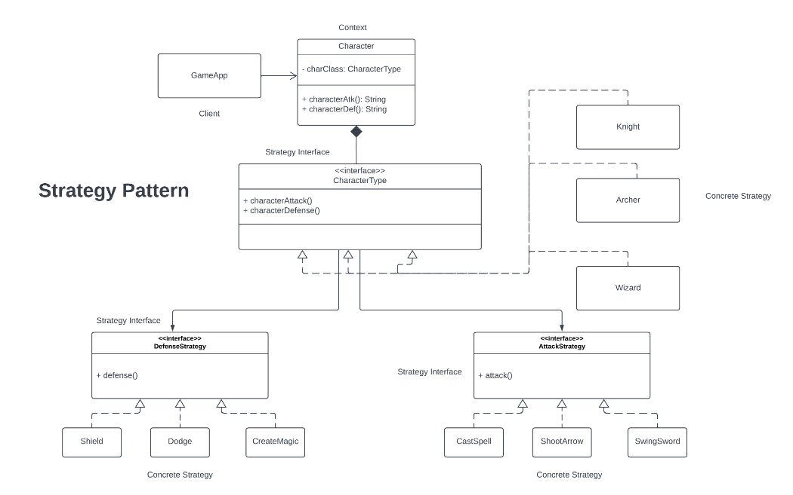

# Strategy Pattern

This repository implements the Strategy Pattern in Java to address a problem scenario in a GameApp involving three types of characters: Knight, Wizard, and Archer. The Strategy Pattern is a behavioral design pattern that allows the definition of a family of algorithms, encapsulating each one, and making them interchangeable. This promotes the "favor composition over inheritance" principle, enabling the algorithm to vary independently from clients using it.

## Problem scenario:

The problem scenario involves three character types, each with specific attack and defense strategies. The characters are:

1. Knight: Attacks with a sword and has three defense strategies (shield, dodge, magic barrier).
2. Wizard: Casts spells and uses magic barrier for defense.
3. Archer: Shoots arrows and uses dodge for defense.

Implement two types of Strategy: <br>
```
	A.  DefenseStrategy 
	     1. Shield 
	     2. Dodge 
	     3. CreateMagic  

	B.  AttackStrategy 
	     1.  CastSpell 
	     2.  ShootArrow 
	     3.  SwingSword   
```
	

## Refactor the existing codes and provide the UML Diagram:
```
public class Character {
    private String type;

    public Character(String type) {
        this.type = type;
    }

    public void attack() {
        if (type.equals("Knight")) {
            System.out.println("Knight attacks with a sword!");
        } else if (type.equals("Wizard")) {
            System.out.println("Wizard casts a spell!");
        } else if (type.equals("Archer")) {
            System.out.println("Archer shoots an arrow!");
        }
    }

    public void defend() {
        if (type.equals("Knight")) {
            System.out.println("Using a shield to defend!");
	System.out.println("Dodgin to avoid attack!");
            System.out.println("Creating a magic barrier for defense!"");		

        } else if (type.equals("Wizard")) {
            System.out.println("Creating a magic barrier for defense!"");
        } else if (type.equals("Archer")) {
            System.out.println("Using a shield to defend!"");
        }
    }
}
```

## Implementation of Strategy Pattern

<p align="center">
    
</p>

## Unified Modeling Language (UML) Class Diagram

<p align="center">
    
</p>
