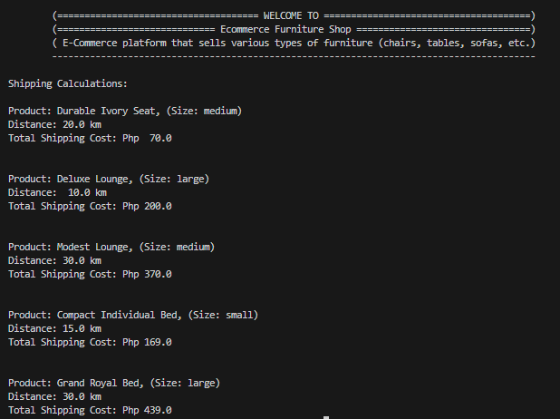
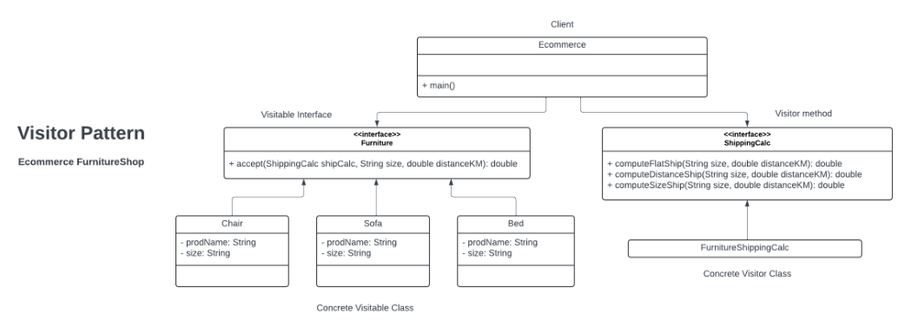

# Visitor Pattern 

This repository implements the Visitor Pattern in Java to address a problem scenario in an e-commerce platform that sells various types of furniture such as chairs, tables, and sofas. The goal is to calculate shipping costs based on the furniture type and size, with each type having its own unique shipping cost calculation logic. Instead of implementing separate shipping logic within each furniture class, which would lead to tight coupling and difficulty adding new furniture types in the future, the Visitor Pattern is employed to decouple the shipping cost calculation logic from the furniture classes.

## Benefits
The Visitor Design Pattern is a powerful tool for separating the logic of operations on objects from the objects themselves. This leads to several advantages, making it applicable in various scenarios:
1. Adding New Operations to Existing Object Hierarchies.
2. Processing Objects in Different Ways.
3. Double Dispatch.
4. Decoupling Algorithms from Data Structures

____________________________________________________________________
The Visitor Pattern offers a flexible and maintainable approach for adding new operations to existing object hierarchies. Consider using it when you need to decouple the logic of operations from the objects themselves, especially when dealing with complex object structures or the need for runtime polymorphism based on both object and visitor types.

## Components of Visitor Pattern
1. Visitable Interface: This interface declares an accept method that takes a Visitor as an argument. This method allows the visitor to perform the desired operation on the Visitable object.
2. Concrete Visitable Classes: These classes implement the Visitable interface and represent the objects you want to perform operations on. They typically override the accept method to delegate the operation to the specific Visitor.
3. Visitor Interface: This interface declares a visit method for each concrete Visitable class. Each visit method takes the corresponding Visitable object as an argument and defines the operation to be performed on that type of object.
4. Concrete Visitor Classes: These classes implement the Visitor interface and provide specific implementations for the visit methods defined in the Visitor interface. These implementations define the actual operations to be performed on each concrete Visitable class.

## Problem scenario:

You are a software developer working on an e-commerce platform that sells various types of furniture (chairs, tables, sofas, etc.). You want to implement a functionality that calculates the shipping cost based on the furniture type and size.

Each furniture type might have its own unique shipping cost calculation logic. For example, chairs might be lightweight and have a flat shipping rate, while sofas might be bulky and require a distance-based shipping cost calculation. Implementing separate shipping logic within each furniture class would lead to tight coupling and difficulty adding new furniture types in the future.

Implement a visitor design pattern approach: 

<ul>
<li>You must show the different elements of visitor design in your solution.  
<li>DO NOT USE ABSTRACT CLASSES. 
<li>You are free to name your interfaces and concrete classes. 
<li>Have a client code that will test your program.
<li>Design your own UML Class Diagram.  </li>
</ul>

## Implementation of Visitor Pattern

    

## Unified Modeling Language (UML) Class Diagram

    

