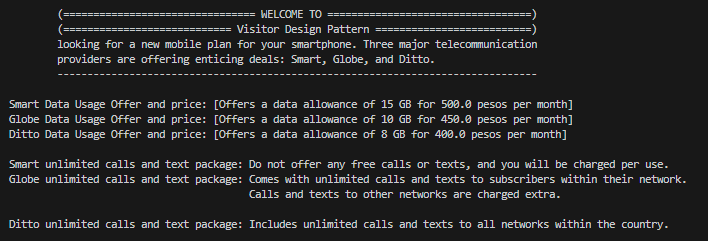

# Visitor Pattern 

The Visitor Pattern is a behavioral design pattern that lets you add new operations to a hierarchy of objects without modifying their classes. It separates the logic for performing operations on these objects from the objects themselves. This allows for:

<ul>
<li>Open/Closed Principle compliance: New functionalities can be added through Visitor implementations without touching existing object classes.
<li>Loose Coupling: Objects are unaware of the specific visitor classes that operate on them.
</ul>

# Problem scenario:

**Imagine you are looking for a new mobile plan for your smartphone. Three major telecommunication providers are offering enticing deals: Smart, Globe, and Ditto.**
____________________________________________________________________

<ul>
<li>Smart: Offers a data allowance of 15 GB for ₱500 per month. However, they do not offer any free calls or texts, and you will be charged per use.</li>
<li>Globe: Provides a data allowance of 10 GB for ₱450 per month. This plan comes with unlimited calls and texts to subscribers within their network. Calls and texts to other networks are charged extra.</li>
<li>Ditto: Offers a data allowance of 8 GB for ₱400 per month. This plan includes unlimited calls and texts to all  networks within the country. </li>
</ul>

# Test your codes before the given client program:

```
public class TelcoPromo {
  public static void main(String[] args) {
    TelcoSubscription smart = new Telco(15, 500, Smart,false);
    TelcoSubscription globe = new Telco(10, 450, Globe,true);
    TelcoSubscription ditto = new Telco(8, 400, Ditto,true);

    UsagePromo promo = new TelcoAllowance();
    UnliCallOffer unli = new UnliCallTextPackage();    

    System.out.println("Smart Data Usage Offer and price: " + promo.showAllowance(smart) );
    System.out.println("Globe Data Usage Offer and price" + promo.showAllowance(globe));
    System.out.println("Ditto Data Usage Offer and price" + promo.showAllowance(ditto));

    System.out.println("\nSmart unlimited calls and text package: " + unli.showUnliCallsTextOffer(smart));
    System.out.println("Globe unlimited calls and text package: " + unli.showUnliCallsTextOffer(globe));
    System.out.println("Ditto unlimited calls and text package: " + unli.showUnliCallsTextOffer(ditto));
  }
}

```

# Implementation of Visitor Pattern

<p align="center">
    
</p>

## Unified Modeling Language (UML) Class Diagram

<p align="center">
  
</p>
